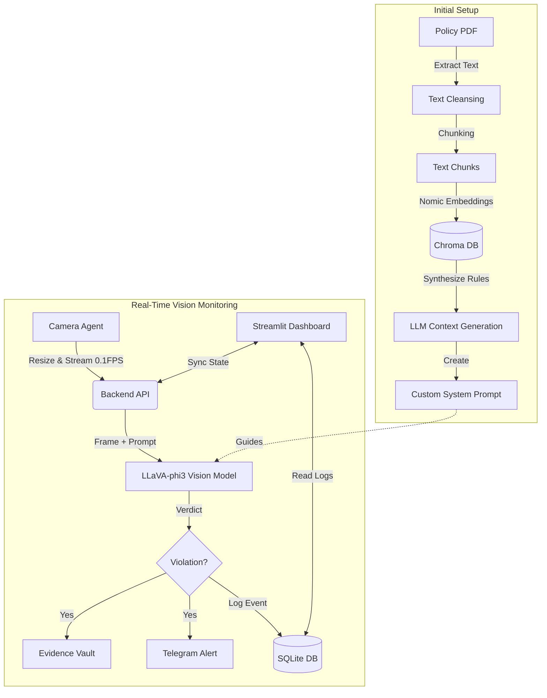

# 👁️ Visionary: Autonomous AI Workplace Safety Monitor

**Visionary** is an intelligent, real-time computer vision system that autonomously monitors workplace environments for safety compliance. It uses **Retrieval-Augmented Generation (RAG)** to dynamically learn safety policies from PDF manuals and enforces them using a **Vision-Language Model (VLM)**.

> 🚀 **Key Differentiator**: Unlike traditional CV systems that are hardcoded for specific objects (e.g., "detect hard hat"), Visionary reads a policy document (e.g., "Construction Site Safety Manual.pdf") and *understands* what to look for, adapting its behavior instantly without retraining.

---

## 🏗️ Architecture

The system is built with a modular, scalable architecture designed for maintainability and performance.



---

## ✨ Key Features

### 1. 📚 Dynamic Policy Learning (RAG)
- **Upload any PDF manual**: The system embeds the text into a Vector Database (ChromaDB).
- **Auto-Prompting**: It generates a custom "System Persona" (e.g., *"You are a Safety Officer..."*) tailored to the specific rules in the document.
- **Strict Adherence**: The AI strictly follows the generated persona, ignoring generic behaviors.

### 2. 👁️ Real-Time Visual Intelligence
- **Model**: Powered by `llava-phi3`, a state-of-the-art quantized Vision-Language Model running locally via Ollama.
- **Performance**: Optimized for 0.1 FPS analysis to balance latency and resource usage.
- **Privacy**: All processing happens locally on-device.

### 3. 📸 Forensic Evidence Vault
- **Auto-Capture**: When a violation is detected (e.g., "No safety goggles"), the exact video frame is saved to the `backend/evidence/` vault.
- **Dashboard Integration**: Review logs in the dashboard and see the actual photo evidence side-by-side with the AI's verdict.

### 4. 🛡️ Enterprise-Grade Controls
- **Backend-Enforced State**: The "Start/Stop" buttons physically gate the backend's processing pipeline.
- **Connection Resilience**: Dashboard includes auto-retry logic for 60s during system startup (e.g., while models are loading).
- **Alerts**: Real-time notifications via Telegram bot integration.

---

## 🛠️ Technology Stack

- **Core**: Python 3.10+
- **AI/ML**: Ollama, LangChain, ChromaDB
- **Backend**: FastAPI, SQLite
- **Frontend**: Streamlit
- **Vision**: OpenCV

---

## 📂 Project Structure

The project follows a clean, modular structure:

```text
Visionary/
├── backend/
│   ├── backend.py       # API Gateway & Orchestrator
│   ├── database.py      # SQLite Connection & Logging Logic
│   ├── alerts.py        # Telegram Notification Logic
│   ├── rag.py           # RAG Engine (Ingest & Prompt Gen)
│   ├── evidence/        # Storage for violation snapshots
│   └── system_prompt.txt # Dynamically generated AI persona
├── frontend/
│   ├── dash.py          # Main Dashboard Entry Point
│   ├── components.py    # Reusable UI Widgets
│   ├── styles.py        # CSS & Theming
│   └── camera.py        # IoT Camera Agent
├── run.py               # Master startup script
└── requirements.txt     # Dependencies
```

---

## 🚀 Getting Started

### Prerequisites
1. **Python 3.10+** installed.
2. **Ollama** installed:
   - **macOS/Linux**: `curl -fsSL https://ollama.com/install.sh | sh` or `brew install ollama`
   - **Windows**: Download from [ollama.com](https://ollama.com/download)
3. **Start Ollama** (if not running in background):
   ```bash
   ollama serve
   ```
4. **Pull Required AI Models**:
   The system requires a Vision model (`llava-phi3`) and an Embedding model (`nomic-embed-text`). Run these commands in your terminal:
   ```bash
   ollama pull llava-phi3
   ollama pull nomic-embed-text
   ```

### Installation

1.  Clone the repository.
2.  Install dependencies:
    ```bash
    pip install -r requirements.txt
    ```
### Setup Telegram Alerts (Optional)
To receive real-time notifications on your phone:
1. **Get Bot Token**: Open Telegram, search and start `@BotFather`. Send `/newbot`, choose a name and username ending in `bot`. Copy the `TELEGRAM_TOKEN` provided.
2. **Get Chat ID**: Search and start `@userinfobot` to get your `Id`. Copy this as your `TELEGRAM_CHAT_ID`.
3. **Activate Bot**: Search for your bot's username and click **Start** (mandatory to allow messages).
4. **Configure Project**: Create a `.env` file in the `backend/` directory:
   ```env
   TELEGRAM_TOKEN=your_copied_token
   TELEGRAM_CHAT_ID=your_copied_chat_id
   ```

### Usage

Run the entire system with a single command:

```bash
python run.py
```

This will launch:
1.  **Backend Server** (Port 8000)
2.  **Dashboard** (Port 8501)
3.  **Camera Agent** (Active immediately)

### Workflow
1.  Open the Dashboard (`http://localhost:8501`).
2.  **Upload a Safety Policy PDF**.
3.  Click **"Ingest Policy"** to train the agent.
4.  Click **"🚀 Start Operation"**.
5.  Monitor the feed for alerts!

---

## 🔮 Future Roadmap
- [ ] Multi-camera support with RTSP streams.
- [ ] Email/SMS alerts via SMTP/Twilio.
- [ ] Historical trend analysis & reporting.

---

## 📄 License

This project is licensed under the MIT License - see the [LICENSE](LICENSE) file for details.

---
*Built with ❤️ by Sahil Bhavesh Choudhary*
