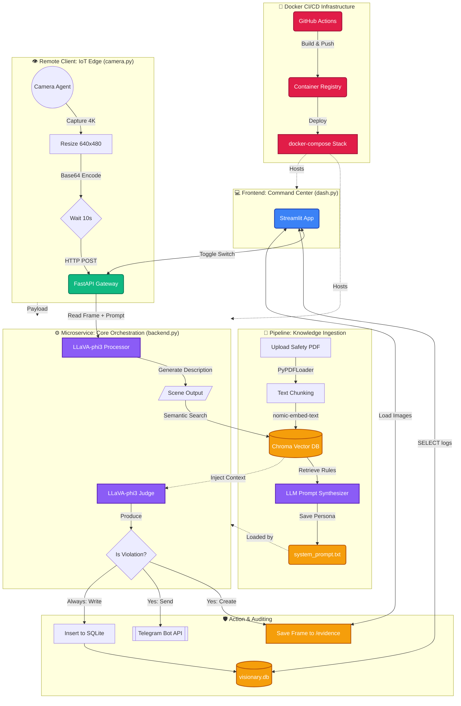

# 👁️ Visionary: Autonomous AI Workplace Safety Monitor

[](.github/workflows/deploy.yml)
[](docker-compose.yml)
[](https://www.python.org/)

**Visionary** is an intelligent, real-time computer vision microservice designed to autonomously monitor workplace environments for safety compliance. Leveraging **Retrieval-Augmented Generation (RAG)** alongside a locally-hosted **Vision-Language Model (VLM)**, the system dynamically parses PDF safety manuals and strictly enforces their protocols via live camera feeds.

> **Technical Differentiator**: Traditional CV systems (like YOLO) require thousands of labeled images and days of retraining to detect new objects. **Visionary** utilizes Zero-Shot Learning—simply upload a new PDF manual, and the AI instantly adapts its reasoning and detection parameters without any retraining.

---

## 🌟 Technical Highlights for Recruiters
- **Generative AI & RAG Engineering**: Designed a pipeline using LangChain and ChromaDB to chunk, embed, and synthesize system personas from raw PDF documents.
- **Locally Hosted LLM/VLMs**: Deployed `llava-phi3` via Ollama for edge-compute privacy, achieving 0% cloud dependency for image processing.
- **Microservices Architecture**: Built a decoupled system using **FastAPI** (Backend API), **OpenCV** (IoT camera agent), and **Streamlit** (Frontend Dashboard).
- **CI/CD & Containerization**: Fully dockerized application orchestrated with `docker-compose`. Automated testing and deployment pipelines managed via **GitHub Actions**.

---

## 🏗️ Architecture Design

The system is built with a modular, scalable architecture designed for maintainability and edge-device performance.



---

## 💼 Business Value: Legacy CV vs Visionary RAG

| Feature | Legacy Systems (YOLO / OpenCV) | **Visionary (VLM + RAG)** |
| :--- | :--- | :--- |
| **Logic Updates** | **Months of Work**. Requires collecting 10,000+ images of the new object, manually drawing bounding boxes, and retraining the ML model locally. | **3 Minutes**. Zero-shot learning. Upload a new PDF text manual to the dashboard. The AI instantly reads the text and updates its behavior. |
| **Semantic Understanding** | **Brittle**. A YOLO model sees a hard hat. It does not understand if the hard hat is correctly on a worker's head, or just resting idly on a table. | **Intelligent**. The LLM semantically *understands* the scene ("The worker's head is unprotected, the hat is on the table") and applies logical reasoning. |
| **Auditing & Explainability** | **Black Box**. Spits out a rigid array of coordinates and confidence scores: `[HardHat: 0.95]`. You do not know *why* an alert fired. | **Human-Readable Audit**. Logs exact natural language scene descriptions and an explicit explanation (e.g., "Violation: Goggles are on forehead, not eyes"). |
| **Enterprise Privacy** | Historically required streaming immense high-res footage to cloud endpoints (OpenAI/AWS), posing huge IP risks. | **100% Offline Edge Compute**. By using heavily quantized small-language models (`llava-phi3`), the "Cloud Brain" runs entirely locally. |

---

## 🛠️ Comprehensive Tech Stack

- **Containerization & CI/CD**: Docker, Docker Compose, GitHub Actions
- **AI / Foundational Models**: Ollama (`llava-phi3` Vision Model, `nomic-embed-text` Embeddings)
- **RAG Architecture**: LangChain, ChromaDB Vector Store
- **Backend API**: Python 3.10+, FastAPI, Uvicorn, SQLite3
- **Frontend Dashboard**: Streamlit, Custom CSS
- **Edge Devices**: OpenCV (`cv2`), REST via Request Library
- **Alerts**: Telegram APIs

---

## 🚀 Quick Start (Docker Installation - Recommended)

Visionary is fully containerized, making deployment to AWS/GCP or a local environment extremely simple.

### Prerequisites
1. Install [Docker & Docker Compose](https://www.docker.com/products/docker-desktop/).
2. Install Python 3.10+ (for running the local camera capture agent).

### Launching the Infrastructure
```bash
# 1. Clone the repository
git clone https://github.com/Sahil-Choudhary/Visionary.git
cd Visionary

# 2. Spin up the application stack (Ollama + FastAPI Backend + Streamlit Dashboard)
docker-compose up -d --build

# 3. Pull the required models into the running Ollama container
docker exec -it visionary-ollama ollama run llava-phi3
docker exec -it visionary-ollama ollama pull nomic-embed-text
```

### Running the Camera Edge Agent
*(Note: Mac/Windows users should run the camera script natively on their host machine, as Docker Desktop aggressively sandboxes hardware webcams).*
```bash
pip install opencv-python requests
python frontend/camera.py
```

Visit the Dashboard at **[http://localhost:8501](http://localhost:8501)** to govern the system!

<details>
<summary><b>Click here to view manual/local execution steps</b></summary>

### Manual Installation
If you prefer not to use Docker:
```bash
python3 -m venv venv
source venv/bin/activate
pip install -r requirements.txt
```
*Ensure you have Ollama installed locally and run `ollama serve`.*
```bash
python run.py
```
</details>

---

## 📫 Reach Out
Thank you for checking out Visionary! I'm passionate about architecting scalable backend systems and integrating bleeding-edge Generative AI into practical workflows.

If you are a recruiter or an engineering manager checking out my code, I’d love to connect:
- **Built By**: Sahil Bhavesh Choudhary
- **Explore My GitHub**: [https://github.com/Sahil-Choudhary](https://github.com/Sahil-Choudhary)

---
*Licensed under the MIT License - see the [LICENSE](LICENSE) file for details.*
